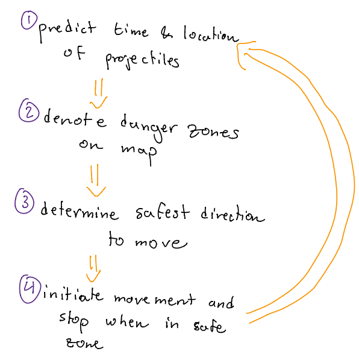
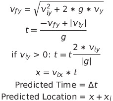
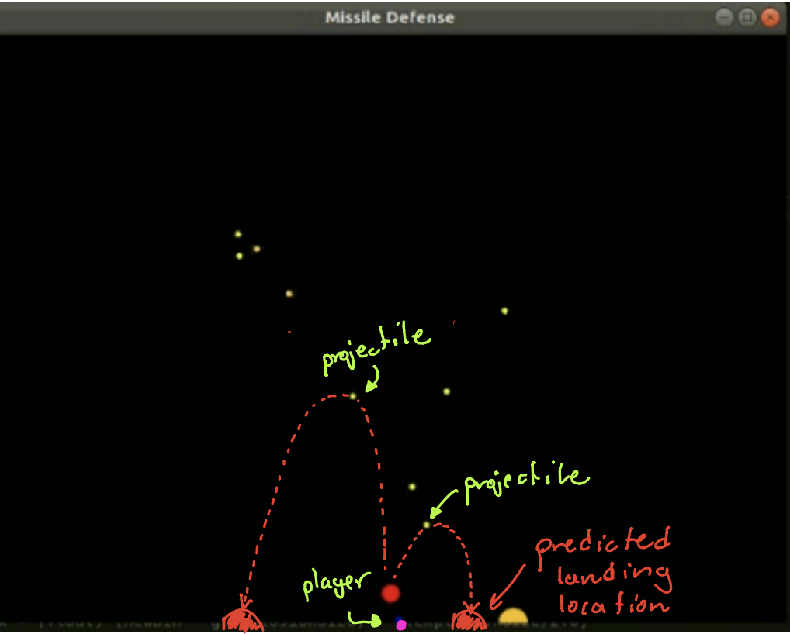
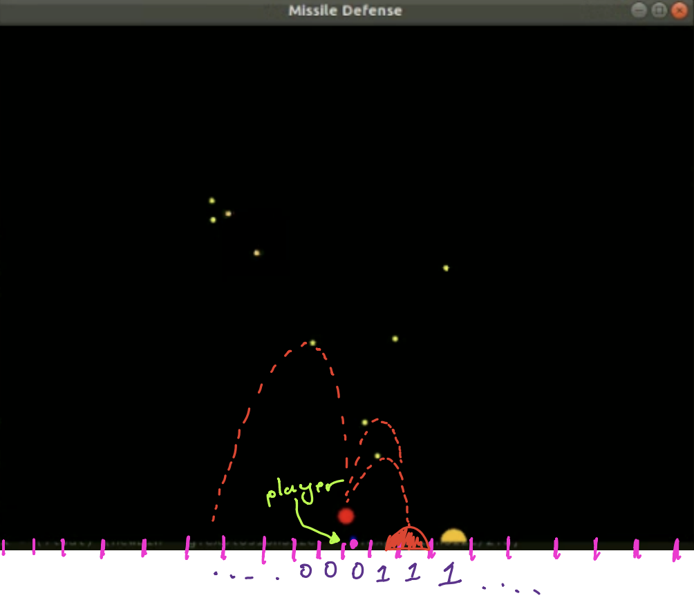

# Missle Defense Game

# Configuration
If running on VS Code, make sure to configure the CMake build version to GCC 5.5.0. Versions higher than this will cause compile errors.

# How to Run

## General Workflow

1. Open startup.cpp. Set the desired difficulty level.
2. Open Controller.cpp. Set the teleportationCheat variable to either true or false.
3. Configure the binInterval and safetyRad variables to vary performance
    * (default) binInterval = 2.5
    * (default) safetyRad = 4
4. Build the CMake and Run the programs through terminal
5. Press 'C' for the AI controller. Press 'space' for manual conrol of the player.

# Grading Section

## Question 01: AI System Overview

The AI controller  is derived from the functions created in theController.cpp file. The control function serves as the master function of the AI system and executes the different steps to update the player's perception of its environment and act accordingly.  The overall flow of the AI system is shown in the diagram below.  The system first predicts the landing locations of all live projectiles, the determines the danger zones on the map. If the player is standing on a danger zone, a direction of travel will be determine in order to move the player to a safe location on the map. 

Once a player object is generated in the game, a one-hot vector variable is declared and serves as a discretized layout of the map. Each element of the one-hot vector denotes a bin section of the map. The default bin interval value is set to 2.5. Next, the program transitions to the trackProjectiles function to predict where all projectiles will land on the map.

In thetrackProjectiles function, the projectile information is pulled from the game class input 'g'. The function uses common kinematics equations to determine the time of impact and the landing location of theprojectiles. The following kinematics equations are used:

To determine where the projectile will land, the function first assumes that the velocity is negative, meaning that the projectile is speeding to the ground. The change in time to impact on the ground is determined based on the given acceleration of gravity, the absolute negative of the projectile's velocity, and the vertical height of the projectile. If the objects velocity is greater than zero, then the change in time variable is incremented with the time taken for the projectile to rise, fall, and reach the negative of its initial velocity. The change in horizontal distance is predicted based on the initial horizontal value and previously-determined change in time to impact. The change in time and total horizontal distance of the projectile at time of impact are returned to the control function.

ThetrackProjectile function outputs the predicted time and location values for each projectile.  Calculated time-of-impact and location-of-impact values are stored in the pre-defined class prediction variable.  The prediction variable is a global variable that can be seen and modified by other functions in theController.cpp file.Afterwards, the one-hot vector is modified to denote danger zones on the map.

In the determineSafeSpots function,  the  system  runs  through  both  the  elements  in  the  global prediction variable and the explosion class object, stored in the game class 'g'.  A safety radius is prespecified which is the buffer distance around the centroid of the explosion location. All bin locations within that zone is set to '1' in the binVect one-hot vector to denote whether or not each increment of location on the map is safe (i.e.  0) or dangerous (i.e.  1).  In addition to determining danger zones based on the data in binVect variable, the function also determines danger zones based on the locations of current explosions. The helper function dangerSetter is used to populate '1' values at across designated ranges on the map

After determining the danger zones on the map, the AI will then determine if the player’s location is on a dangerzone and act accordingly. Because the binVect variable is a global variable, the control function can determine if the current bin that the player is on is hot (i.e. 1). If the current location is counted as a danger bin, then the system will transition to the pickSafeSpot function to determine which direction to go in order to avoid the imminent explosion.

In the pickSafeSpot function, the AI system looks to the left and right sides of the player.  If the left side has more safe zones (i.e.  has more 0’s) than the right side, then the function will output an integer signal which denotes which direction to move.  Likewise, the function will output a right-moving signal if the number of safe zones on the right side of the player is greater than the number of safe zones on the left side of the player. On the edge case scenario where both the left and right side of the player are equal, then the function will randomly select a direction for which the player will traverse. This direction signal will stay constant until the player reaches a safe zone, after which the player will stop. The binVect and prediction variables will continuously update at every game loop and the player will initiate movement when a projectile is predicted to explode in its vicinity.

## Question 02: Development Challenges

The main challenges apparent in this task were:

* Handling environmental edge cases 

One particular edge case is when two predicted explosions are occurring next to each other.  After the AI determines a direction to move, it must continue moving in that direction until it reaches a bin location that is predicted to be safe. If more than one predicted explosion is occurring right after the other, then the next safe location is after that particular explosion. This is an issue due to the relatively slow speed of the player because the player is usually only fast enough to move away from one predicted explosion at a time, not 2 or more. One method to handle this edge case would be to develop a limited range on the left and right side of the player when determining a safe direction to travel. But implementing this feature brings about further edge case scenarios to consider.

* Sectioning the map optimally 

When determining the resolution of the bin locations on the map, there is a balance between performance and efficiency. One must select a resolution that is sparse enough to be computationally efficient yet fine enough to accurately characterize the environment. A lower resolution of the map would bring out an inaccurate depiction of where predicted explosions would occur.  In the extreme case, the AI will think that significantly more spaces on the map are occupied by explosions when those spaces are actually safe to move to. At  the  same  time,  a  higher  resolution  map  would  prove  to  be  computationally expensive.  The balance between the two is one that must be resolved empirically through trial-and-error data where edge cases are heavily considered.

* Avoiding ”drifting” AI behavior 

For example, one issue for AI in this game is opting to drift in one direction.  Whether it be the left or right, the player would fall further and further to one extreme of the map. This may prove difficult to handle because maneuverability is limited. In the case where the player is cornered, there is a higher change of death because the AI can only choose one direction to go. Generally, developing an AI entails implementing safeguards and effective generalization to ensure the player does not fall to local minima maneuvers.

## Question 03: Performances on Harder Difficulties

In the hard difficulty mode, the AI can last for an average for 5-15 seconds. The main challenge with the increased difficulty is the higher likelihood of overlapping and consecutive explosions occurring. The AI is focusing on the explosion closest to the player, namely the explosion directly overhead, and adjusts its position appropriately to avoid it. In many cases in the harder difficulty, the player may be able to move away from the explosion directly overhead, but the player ends up walk right into an explosion that just occurred right after.

## Question 04: Reflections and Thoughts on Assignment

For giving students hands-on experience developing C++, this assignment was able to meet its goal well. Working on this assignment solidified several C++ concepts such as vectors, pointers, references, classes,and variable  types (static,  global,  local,  etc...).   This  assignment requires  the student  to apply  a healthy diversity of concepts in order to develop a working AI model.

One  suggestion  for  improvement  would  be  to  provide  a  failed  AI  model  as  an  example  for  students to improve or replace. This way, students do not have to experiment and test different parts of the program to understand the flow and coding structure of the program. Seeing a poor/failing AI model performing would open students’ eyes to the fundamental code that needs to be implemented to develop a working AI system. In addition, the time saved from this implementation would be greatly appreciated as students may not have the time luxury in the middle of the semester to tinker around with the code to get a basic AI working.

